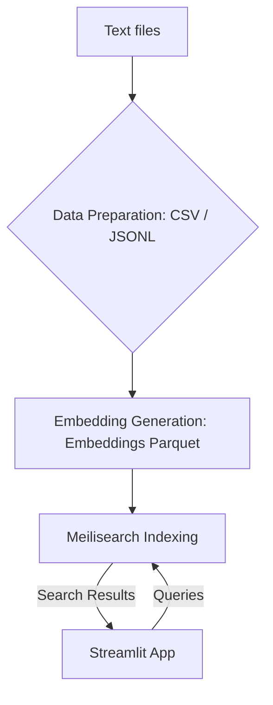
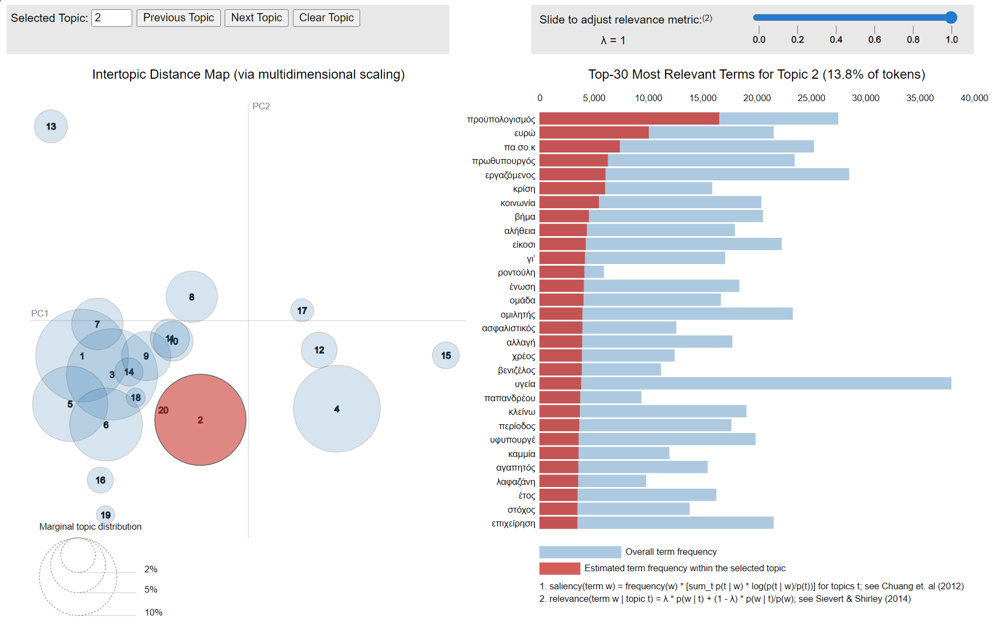
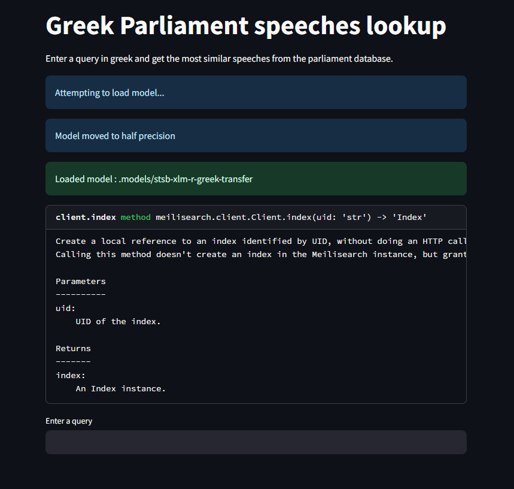
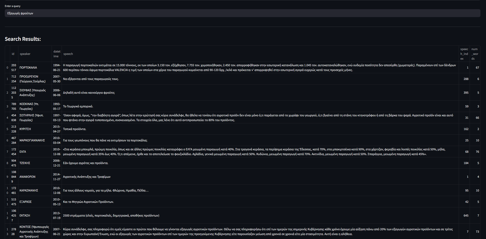

# Greek Parliament Text Analysis
This project is a collection of scripts and tools for processing and analyzing parliamentary speeches in Greece. The following processes are explored:
1. Preprocessing
2. Topic Modeling
3. Embeddings and Vector Search (Hybrid Search)
4. Text search using Elasticsearch

A docker compose file is also provided to quickly setup a meilisearch instance. Elasticsearch is a bit more complicated to set up. Python version is `3.12`, but higher versions should work (except for pyLDAvis).

# Dataset/model
The dataset was obtained from [data.gov.gr](https://data.gov.gr/). Unfortunately, as of the timing of writing this README, it is no longer available. It was a .zip folder containing .txt files with raw speeches, between 1989-2019.

The model used for generating the embeddings is this one: [stsb-xlm-r-greek-transfer](https://huggingface.co/lighteternal/stsb-xlm-r-greek-transfer)
# Images

# Benchmarks
Preprocessing the txt files to CSV/JSONL is quite fast (a couple minutes) considering that multiprocessing is also used. Embeddings generation should not take more than a few hours, depending on your hardware (a GPU will significantly help). 

Searching with Meilisearch on a typical query containing 5-10 tokens needs a couple seconds during the first query for warmup, and the following ones are very fast (`<0.5 seconds`).
# Folders and their purposes

## Preprocessing
### preprocessing/extract_speeches.py
This script is used to extract the speeches from the original text files and write them to CSV files. It uses regular expressions to identify the speakers and speeches, and then writes the extracted data to CSV files.

## Topic Modeling
### topics_modeling/topic_modeling.py
This script is used to train an LDA model on the tokenized speeches. It uses the gensim library to train the model and calculate the topics.

### topics_modeling/describe_topics.py
This script is used to describe the topics identified by the LDA model. It uses the gensim library to calculate the topic weights and the pyLDAvis library to create a visualization of the topics.

### topics_modeling/tokenization.py
This script is used to tokenize the speeches and remove stopwords, punctuation, digits, and words with less than 3 characters. It uses the spacy library to perform the tokenization and filtering.

## Embeddings
### embeddings/greek_embeddings.py
This script is used to generate embeddings for the speeches using the Sentence Transformers library. It reads the speeches from CSV files, generates embeddings for each speech, and writes the embeddings to Parquet files.

### embeddings/insert_meilisearch.py
This script is used to insert the embeddings into a Meilisearch index. It reads the embeddings from Parquet files, prepares the documents for insertion, and inserts them into the index.

### embeddings/embeddings_app.py
This script is used to create an app for exploring the embeddings. It loads the embeddings from Meilisearch, allows the user to search for speeches, and displays the results. Streamlit is used for exploring the frontend. 
## Elasticsearch
Alternatively, we can index the texts for text search using Elasticsearch. They can then be easily explored through something like Kibana.
### elastic_insert.py
This script is used to insert the speeches into an Elasticsearch index. It reads the speeches from CSV files, prepares the documents for insertion, and inserts them into the index.
